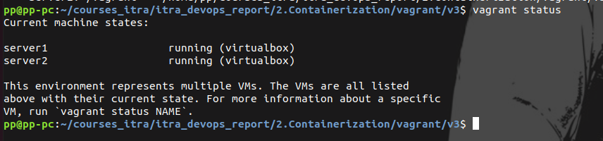
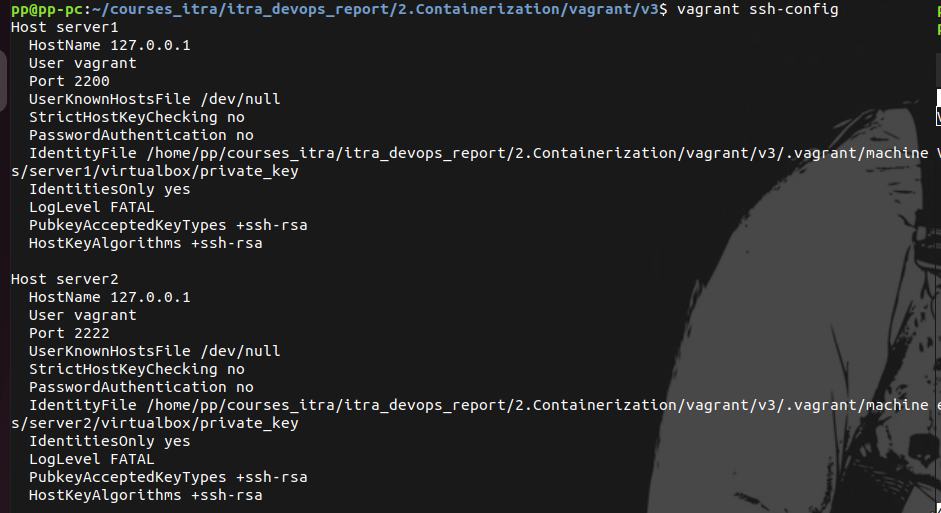
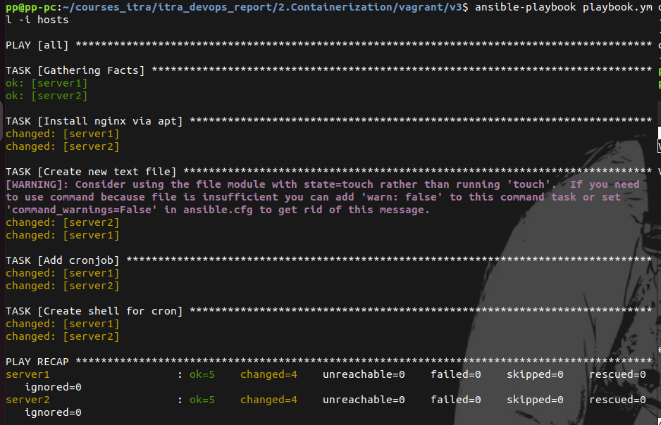
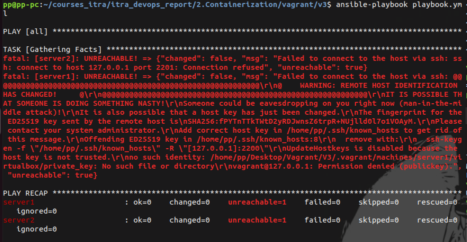

# Vagrant. Task 3
Автоматизация конфигурации и администрирование виртуальной машины с
помощью Ansible

1. Vagrant init - создан Vagrantfile с настройками виртуальной машины
2. Vagrant up - запуск виртуальной машины

3. Созданы файлы ansible.cfg, playbook.yml, hosts
4. Vagrant ssh - подключение к виртуальной машине через SSH

5. Запуск ansible-playbook playbook.yml -i hosts 

6. Vagrant halt, vagrant destroy - остановка и удаление виртуальных машин

ошибки 
 
 vagrant ssh-config, исправлен путь к ключам в файле hosts
