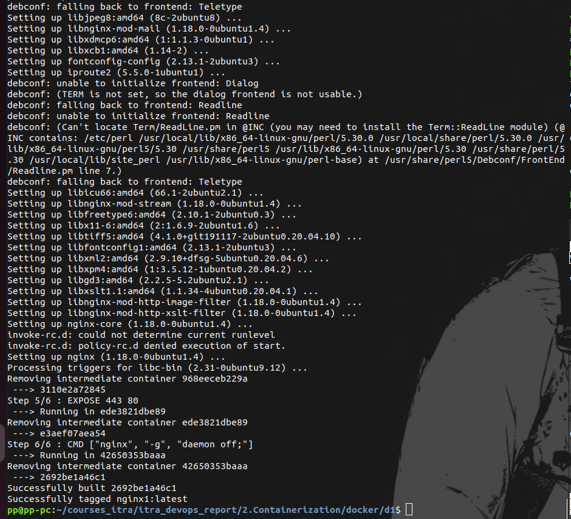
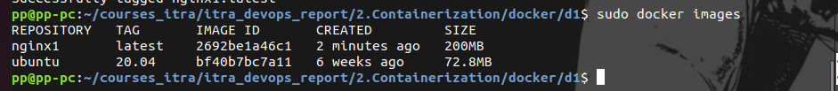
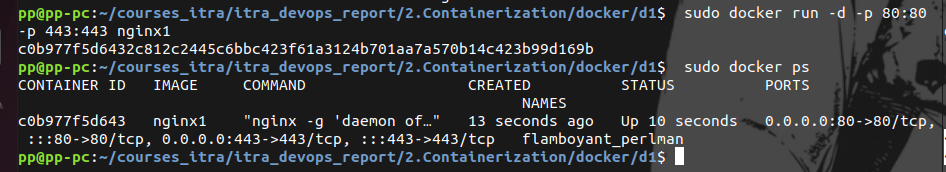

# Docker. Task 4
Создание и запуск контейнера с веб-приложением в Docker

1.  nano Dockerfile

2. sudo docker build -t nginx1 .

3.  sudo docker images
 

4.  sudo docker run -d -p 80:80 -p 443:443 nginx1
 sudo docker ps

5.  http://127.0.0.1/

6. sudo docker stop c0b97

