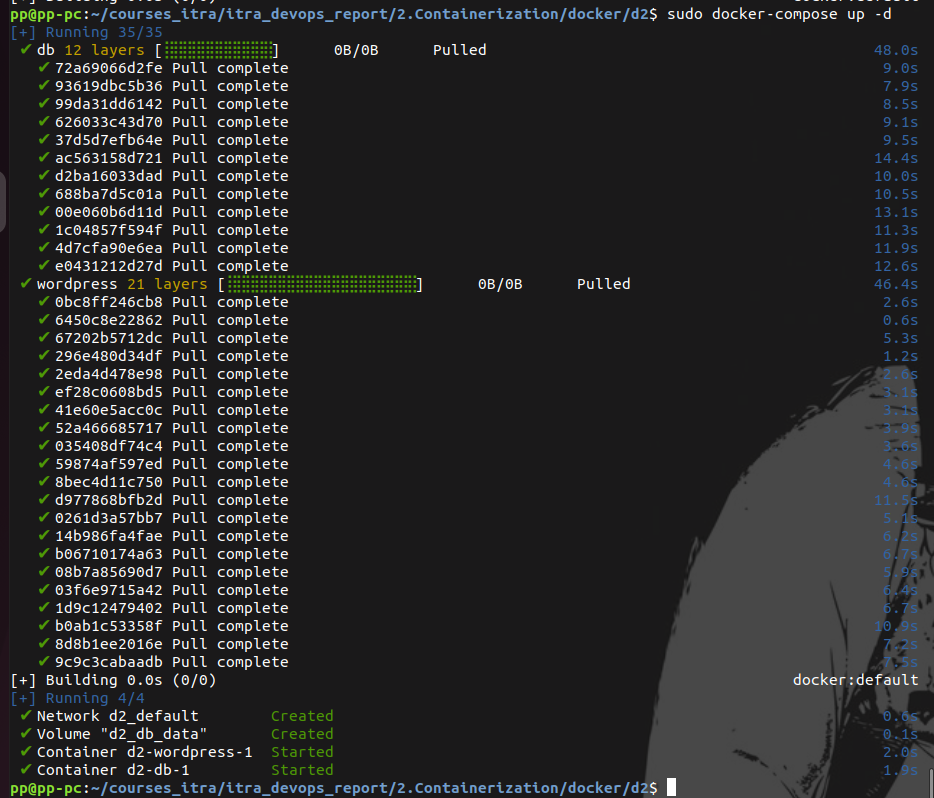
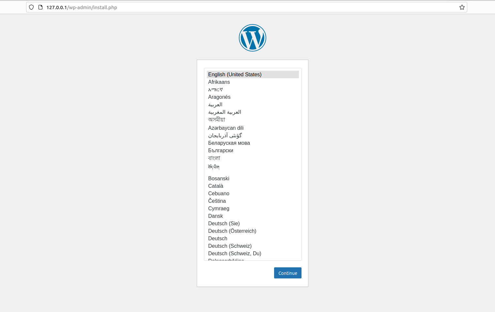

# Docker. task 5
Создание многоконтейнерного приложения с использованием Docker и Docker
Compose

1. Установка Docker и Docker Compose

sudo curl -L "https://github.com/docker/compose/releases/download/v2.23.0/docker-compose-$(uname -s)-$(uname -m)" -o /usr/local/bin/docker-compose

 sudo chmod +x /usr/local/bin/docker-compose

sudo docker-compose --version

2. nano docker-compose.yaml

3. sudo docker-compose build

4. sudo docker-compose up -d

5. sudo docker-compose down
