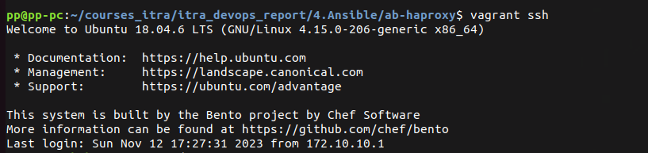
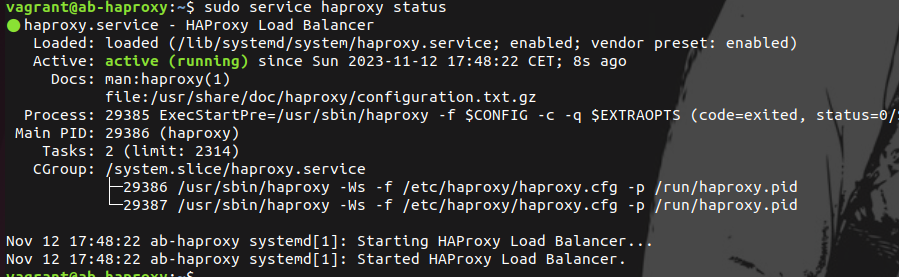
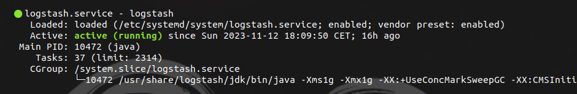
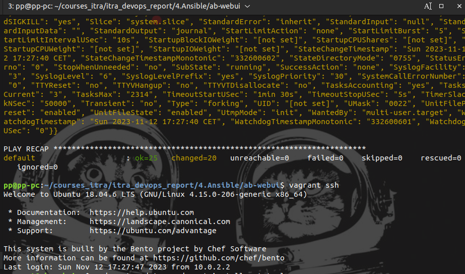
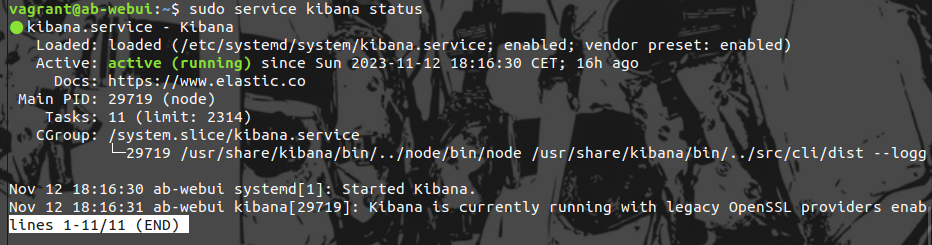
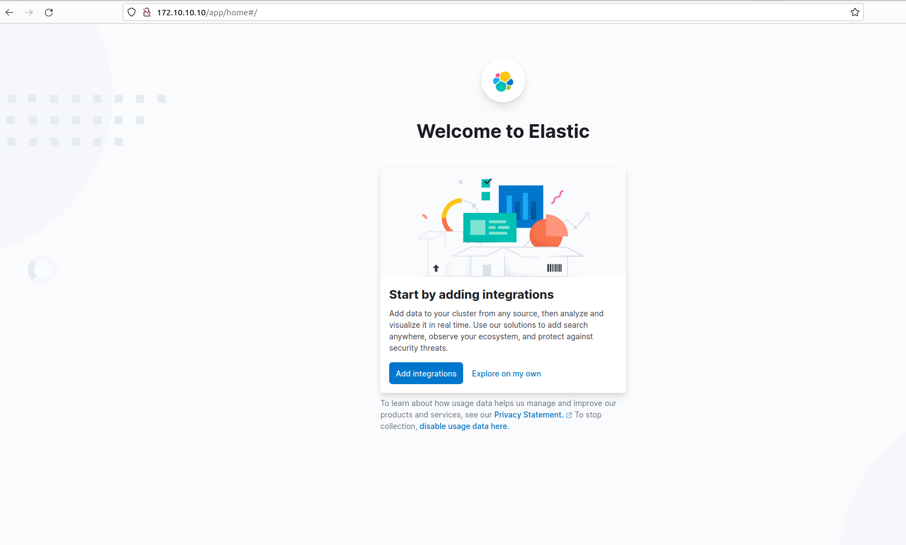

# Ansible

mkdir ab-haproxy
1. Создан Vagrantfile, ansible.cfg и playbook.yaml, в репозитории Galaxy найдены роли и сохранены локально согласно инструкции
2. vagrant up - запущена виртуальная машина - при запуске загружается playbook.yaml
[alt text](./images/Vagrant up_ad-haproxy.png)
3. К серверу можно подключится по ssh

в процессе решения задачи была использована подсеть не позволяющая подключится к серверу - ошибка исправлена - прописана нужная сеть.

mkdir ab-logstash
1. Создан Vagrantfile, ansible.cfg и playbook.yaml, в репозитории Galaxy найдены роли и сохранены локально согласно инструкции
2. vagrant up - запущена виртуальная машина - при запуске загружается playbook.yaml
3. К серверу можно подключится по ssh

 
 mkdir ab-webui
1. Создан Vagrantfile, ansible.cfg и playbook.yaml, в репозитории Galaxy найдены роли и сохранены локально согласно инструкции
2. vagrant up - запущена виртуальная машина - при запуске загружается playbook.yaml
3. К серверу можно подключится по ssh

В VirtualBox запущены три VM

Вебстраница доступна
?????
